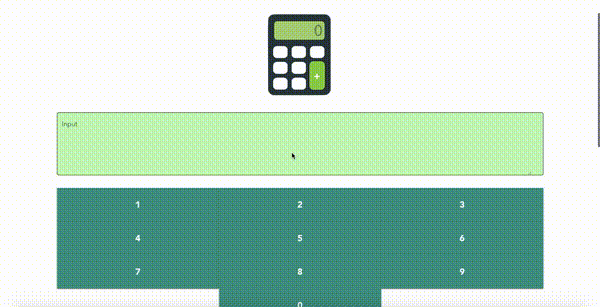

# Calculator

<p align="center">
    
</p>

The calculator is calculator on web application that allow you to `plus`(`+`) only. It was implemented on `Vuetify` and `NodeJS` framework. The application separate into 2-parts:

 - **Backend** - using to calculate 2-inputs string from client.
 - **Frontend** - receives input from user and send digit in string format to server side for calculating. The result will show on the bottom of the screen.

Note: You can separate it out to 2-repositories (frontend/backend).

<p align="center">
    
</p>

## Features

 - [x] Plus only. :)
 - [x] Show digit in currency format.
 - [x] Support chuck digits.
 - [x] Allow typing digit in text area.
 - [x] Allow typing digit only.
 - [x] Theme toggle `light`/`dark` mode.

## Main Project Structure

```bash
project
|- apis
|  |- calculator.js              # Contains calculation function
|  |- package.json               # Dependencies
|  `- server.js                  # Backend service
|- app
|  |- public
|  |  `- index.html              # Main HTML for injecting Vue component
|  |- src
|  |  |- components              # Contains components in view
|  |  |- plugins
|  |  |- App.vue                 # App template
|  |  `- main.js                 # Initial any Vue framework (Vue+Vuetify+store+plugins)
|  |                             # and inject in App template
|  |- store
|  |  |- {state, getters, mutations, actions in .js}
|  |  `- index.js                # Store object that compose the 
|  |                             # state, getters, mutations, actions
|  |- .env.{development/production}
|  |- {any project config file}
|  `- package.json
`- README.md
```

## Installation

Install all dependencies first:

```bash
# Backend, @root dir -> ./apis/
$ npm i

# Frontend, @root dir -> ./app/
$ npm i
```

## Usage

### Backend

```bash
# @root dir -> ./apis/
$ node server
```

By default, start listening on port number `8000`.

### Frontend

**Development**

```bash
# @root dir -> ./app/
$ npm run dev
```

By default, start listening on port number `8080`.

Enjoy via `http://localhost:8080`

**Production**

```bash
# @root dir -> ./app/
$ npm run build:prod
# then serve the output folder "./app/dist" (ref @root dir)
$ npm run serve:prod

# You should see content like this:
# npx: installed 78 in 8.816s

#    ┌───────────────────────────────────────────────────┐
#    │                                                   │
#    │   Serving!                                        │
#    │                                                   │
#    │   - Local:            http://localhost:54342      │
#    │   - On Your Network:  http://192.168.1.33:54342   │
#    │                                                   │
#    │   This port was picked because 5000 is in use.    │
#    │                                                   │
#    │   Copied local address to clipboard!              │
#    │                                                   │
#    └───────────────────────────────────────────────────┘

```

Enjoy via `http://localhost:54342`

## Contributing

#### Adding more formulas

You can adding your formular in `./apis/calculator.js`, now I just provide only plus operator.

#### Checking server connection

I have already provided context path `/health`, you can calling to it based on your approximate time interval.

#### Changing server port in client side

You can change both server IP and port number via variable name `VUE_APP_BASE_URL` in `./app/.env.{YOUR_ENV}`

#### Logic improvement in text area

I added logic to filter input from user, you can improve it in `./app/plugins/filter.js`. This object using in `Result.vue` component too.

#### Changing theme or color

Sure, you can config it in `Vuetify` option.

```js
// Ref. @root ./app/plugins/vuetify.js

// Current theme

{
    theme: {
        dark: false,
        themes: {
            light: {
                primary: colors.teal,
                secondary: colors.indigo,
                inputscreen: '#C9FDBB',
                accent: colors.shades.black, 
                error: colors.red.accent3,
            },
            dark: {
                primary: colors.indigo.darken4,
                secondary: colors.indigo.lighten2,
                inputscreen: '#2b2b2b',
                accent: colors.indigo.darken3,
            }
        }
    }
}
```

## License

MIT